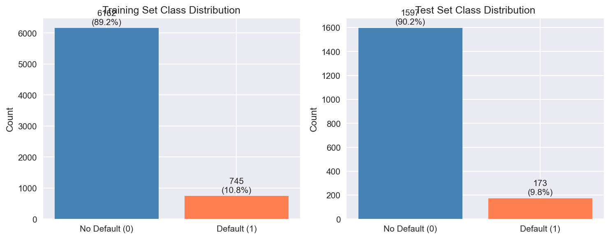
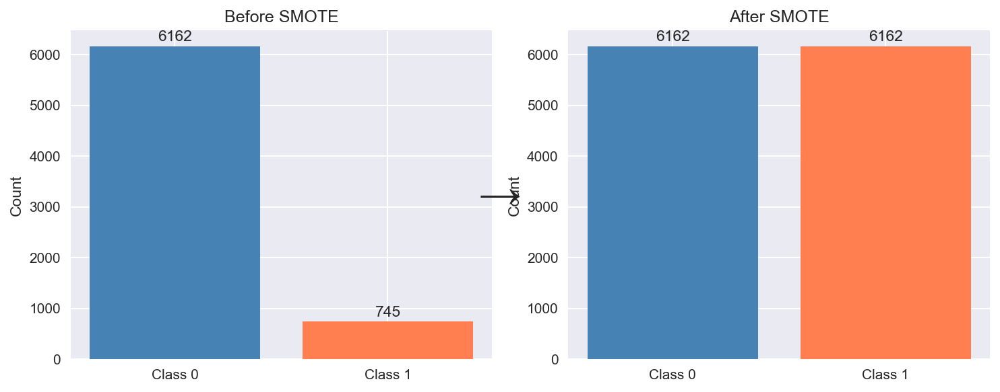
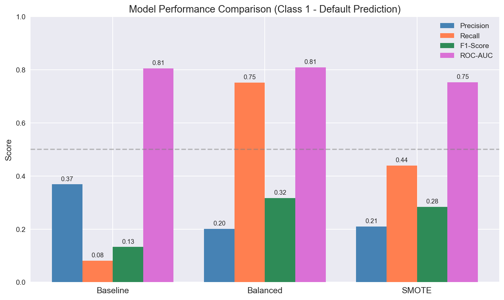
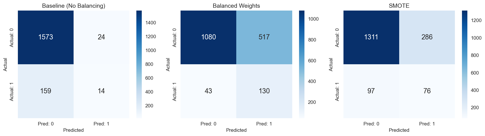

# Handling Imbalanced Classes in Machine Learning: A Practical Comparison

When building machine learning models for real-world problems like fraud detection, disease diagnosis, or loan default prediction, you'll often encounter **imbalanced datasets** where one class significantly outnumbers the other. This article walks through a practical comparison of three approaches to handle this challenge using Logistic Regression.

## The Problem: Why Class Imbalance Matters

In our loan default prediction dataset, we have a classic imbalance problem:



| Dataset | No Default (Class 0) | Default (Class 1) | Imbalance Ratio |
|---------|---------------------|-------------------|-----------------|
| Training | 6,162 (89.2%) | 745 (10.8%) | 8.3:1 |
| Test | 1,597 (90.2%) | 173 (9.8%) | 9.2:1 |

**Why is this a problem?**

A naive classifier can achieve ~90% accuracy by simply predicting "No Default" for every customer. While the accuracy looks impressive, this model is completely useless - it fails to identify the very customers we care about (those who will default).

## Three Approaches to Handle Imbalanced Classes

We'll compare three approaches using Logistic Regression as our base model:

1. **Baseline** - No handling (standard Logistic Regression)
2. **Balanced Weights** - Adjust class weights inversely proportional to frequency
3. **SMOTE** - Generate synthetic minority samples

### Approach 1: Baseline (No Handling)

```python
from sklearn.linear_model import LogisticRegression

logreg_baseline = LogisticRegression(random_state=42, max_iter=1000)
logreg_baseline.fit(X_train, y_train)
```

This is the default approach where we train on the imbalanced data as-is. The model optimizes for overall accuracy, which means it learns to favor the majority class.

### Approach 2: Balanced Class Weights

```python
logreg_balanced = LogisticRegression(
    class_weight='balanced',  # Key parameter
    random_state=42,
    max_iter=1000
)
logreg_balanced.fit(X_train, y_train)
```

**How it works:**
- Automatically adjusts weights inversely proportional to class frequencies
- Weight formula: `n_samples / (n_classes * class_count)`
- For our data: Class 0 gets weight ~0.56, Class 1 gets weight ~4.64
- Misclassifying a minority sample is penalized ~8x more heavily

### Approach 3: SMOTE (Synthetic Minority Over-sampling Technique)

```python
from imblearn.over_sampling import SMOTE

smote = SMOTE(random_state=42)
X_train_smote, y_train_smote = smote.fit_resample(X_train, y_train)

logreg_smote = LogisticRegression(random_state=42, max_iter=1000)
logreg_smote.fit(X_train_smote, y_train_smote)
```

**How it works:**
- Creates **synthetic** samples for the minority class (not just duplicates)
- For each minority sample, finds k-nearest neighbors (default k=5)
- Generates new samples along the line between the sample and its neighbors
- Result: Balanced training data with realistic synthetic examples



**Important:** Only apply SMOTE to training data, NEVER to test data! The test set must represent real-world distribution.

## Results Comparison

### Performance Metrics

| Model | Precision | Recall | F1-Score | ROC-AUC |
|-------|-----------|--------|----------|---------|
| Baseline | 0.368 | 0.081 | 0.133 | 0.805 |
| Balanced | 0.201 | 0.751 | 0.317 | 0.809 |
| SMOTE | 0.210 | 0.439 | 0.284 | 0.753 |



### Confusion Matrices



**Reading the confusion matrices:**
- **Top-left (TN)**: Correctly predicted No Default
- **Top-right (FP)**: Incorrectly predicted Default (false alarm)
- **Bottom-left (FN)**: Missed Default (dangerous!)
- **Bottom-right (TP)**: Correctly predicted Default

## Analysis: Pros and Cons of Each Approach

### Baseline Model

**Results:**
- Precision: 0.368 | Recall: 0.081 | F1: 0.133 | ROC-AUC: 0.805

**Pros:**
- Highest precision (36.8%) - when it predicts default, it's more likely correct
- Lowest false positive rate - fewer false alarms
- Simple, no additional processing needed

**Cons:**
- Catastrophically low recall (8.1%) - misses 92% of actual defaults!
- Only catches 14 out of 173 defaulters
- Essentially useless for the business objective

**When to use:**
- When false positives are extremely costly (e.g., cancer treatment side effects)
- When you have very few minority samples and can't afford any false alarms

---

### Balanced Weights Model

**Results:**
- Precision: 0.201 | Recall: 0.751 | F1: 0.317 | ROC-AUC: 0.809

**Pros:**
- Best recall (75.1%) - catches 130 out of 173 defaulters
- Best F1-score (0.317) - best balance of precision and recall
- Best ROC-AUC (0.809) - best overall discrimination ability
- No additional data processing needed - just one parameter change
- Fast training - same training set size

**Cons:**
- Lower precision (20.1%) - more false alarms (517 non-defaulters flagged)
- May require additional verification step for flagged customers

**When to use:**
- When missing positive cases is costly (fraud, loan default, disease)
- When you can afford to follow up on false positives
- Default choice for most imbalanced classification problems

---

### SMOTE Model

**Results:**
- Precision: 0.210 | Recall: 0.439 | F1: 0.284 | ROC-AUC: 0.753

**Pros:**
- Creates realistic synthetic data points
- Can work well with other algorithms (trees, SVM, neural networks)
- Moderate recall (43.9%) - better than baseline

**Cons:**
- Lower ROC-AUC (0.753) than other methods
- Lower recall than balanced weights for this dataset
- Increases training time (almost 2x more samples)
- Risk of overfitting if minority samples are noisy
- Requires additional library (imbalanced-learn)

**When to use:**
- When you have very few minority samples and need more data variety
- Combined with undersampling (SMOTEENN, SMOTETomek)
- With algorithms that don't have built-in class weighting

## Key Insights

### 1. The Precision-Recall Trade-off

There's an inherent trade-off between precision and recall:
- **High precision** = fewer false alarms, but miss more actual positives
- **High recall** = catch more actual positives, but more false alarms

The right balance depends on your business context.

### 2. For Loan Default Prediction: Recall Matters More

In loan default prediction:
- **Missing a defaulter (False Negative)** = losing the entire loan amount
- **Flagging a good customer (False Positive)** = extra verification cost

The cost of a missed default far exceeds the cost of additional verification, making **high recall** more important.

### 3. Winner: Balanced Weights

For this dataset, `class_weight='balanced'` is the clear winner:
- **Best F1-score** (0.317)
- **Best ROC-AUC** (0.809)
- **Highest recall** (75.1%)
- **Simplest implementation** (one parameter change)

## Practical Recommendations

1. **Start with `class_weight='balanced'`** - it's simple, fast, and often works best
2. **Measure the right metrics** - accuracy is misleading; use F1, recall, and ROC-AUC
3. **Understand your business context** - is it worse to miss a positive or raise a false alarm?
4. **Try SMOTE as an alternative** - especially if balanced weights don't work for your algorithm
5. **Never apply resampling to test data** - it must represent real-world distribution

## Code Summary

```python
from sklearn.linear_model import LogisticRegression
from imblearn.over_sampling import SMOTE

# Option A: Balanced Weights (Recommended)
model = LogisticRegression(class_weight='balanced')
model.fit(X_train, y_train)

# Option B: SMOTE
smote = SMOTE(random_state=42)
X_resampled, y_resampled = smote.fit_resample(X_train, y_train)
model = LogisticRegression()
model.fit(X_resampled, y_resampled)
```

## Conclusion

Class imbalance is a common challenge in real-world machine learning projects. The key takeaways:

1. **Don't trust accuracy** on imbalanced datasets
2. **Balanced class weights** offer a simple, effective solution with minimal code changes
3. **SMOTE** provides an alternative through synthetic data generation
4. **Choose your approach** based on your specific business costs and constraints

For our loan default prediction case, the balanced weights approach improved recall from 8% to 75% - meaning we can now catch 9 out of 10 potential defaulters instead of missing almost all of them. That's the difference between a useless model and a valuable business tool.

---

*This analysis was performed on a loan application dataset with ~8,800 samples and 25 features after preprocessing.*
