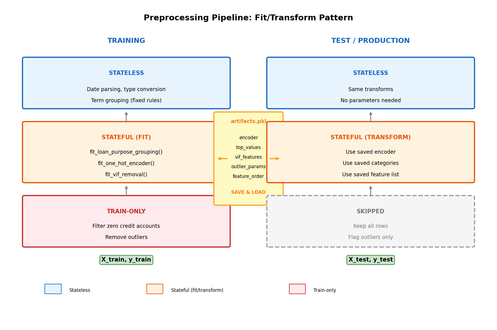

# Production-Ready Preprocessing: Stateful vs Stateless Transforms

Most ML tutorials show preprocessing as a single block of code. This works for experiments but breaks in production. The solution? Understand which operations are **stateful** vs **stateless**, and use the **fit/transform pattern**.

## The Problem

```python
# Common mistake: fitting on ALL data
encoder = OneHotEncoder()
encoder.fit(full_data)  # Data leakage!
```

When you fit on all data (including test), your model "sees" information from the test set during training. This inflates your metrics and fails in production when new categories appear.

## Three Types of Operations



### 1. Stateless (Blue) - No Learning Required

These apply the same fixed rules to any data:

```python
def apply_term_grouping(df):
    """Fixed mapping - no parameters learned."""
    def group_term(term):
        if term in [18, 24]: return '18-24'
        if term in [30, 36]: return '30-36'
        # ... fixed rules
    df['Term_grouped'] = df['Term'].apply(group_term)
    return df
```

**Examples:** Date parsing, type conversion, fixed category mapping

### 2. Stateful (Orange) - Fit on Train, Transform Both

These learn parameters from training data:

```python
# FIT: Learn categories from training
def fit_one_hot_encoder(train_df, columns):
    encoder = OneHotEncoder(handle_unknown='ignore')
    encoder.fit(train_df[columns])
    return encoder

# TRANSFORM: Apply to any data
def transform_one_hot(df, encoder, columns):
    encoded = encoder.transform(df[columns])
    return encoded
```

**Examples:** One-hot encoding, scaling, VIF feature selection, outlier thresholds

### 3. Train-Only (Red) - Never Apply to Test

Some operations only make sense on training data:

```python
def filter_zero_credit_accounts(df):
    """Remove rows with no credit history - TRAIN ONLY."""
    return df[df['ALL_Count'] != 0]

def remove_outliers(df):
    """Remove extreme values - TRAIN ONLY."""
    return df[df['is_outlier'] == 0]
```

**Why?** In production, you must handle ALL incoming data. You can't reject a customer just because they're an outlier - you flag them and let the model decide.

## The Artifacts Dictionary

The key to production ML is saving everything learned during training:

```python
artifacts = {
    'loan_purpose_top_values': ['debt consolidation', 'car', ...],
    'onehot_encoder': fitted_encoder,
    'vif_kept_features': ['Amount', 'ALL_AgeOfOldestAccount', ...],
    'outlier_params': {'mean': 56053.06, 'std': 111753.76},
    'final_feature_order': [...],  # Critical for consistent columns
}

# Save
joblib.dump(artifacts, 'pipeline_artifacts.pkl')

# Load (in production)
artifacts = joblib.load('pipeline_artifacts.pkl')
```

**What's inside `artifacts.pkl`:**

| Key | Purpose |
|-----|---------|
| `onehot_encoder` | Fitted sklearn encoder object |
| `loan_purpose_top_values` | Top N categories learned from training |
| `vif_kept_features` | Features that passed VIF analysis |
| `outlier_params` | Mean/std for outlier detection |
| `final_feature_order` | Exact column order for model input |

## Clean Notebook Pattern

Separate your code into reusable modules:

```
project/
├── src/
│   └── loan_preprocessing_pipeline.py  # All fit/transform functions
├── notebook/
│   └── training.ipynb                   # Clean, minimal code
└── pipeline_artifacts.pkl               # Saved for production
```

**In your notebook:**

```python
from src.loan_preprocessing_pipeline import (
    fit_preprocessing_pipeline,
    transform_training_data,
    transform_test_data,
    save_artifacts,
)

# 1. Fit on training data
artifacts = fit_preprocessing_pipeline(train_df)

# 2. Transform training data
X_train, y_train = transform_training_data(train_df, artifacts)

# 3. Transform test data (uses same artifacts)
X_test, y_test, outliers = transform_test_data(test_df, artifacts)

# 4. Save for production
save_artifacts(artifacts, 'pipeline_artifacts.pkl')
```

## Production Inference

When deploying, you only need the artifacts file:

```python
from src.loan_preprocessing_pipeline import load_artifacts, transform_test_data

# Load saved artifacts
artifacts = load_artifacts('pipeline_artifacts.pkl')

# Transform new data (same function as test data)
X_new, _, outlier_flags = transform_test_data(new_customer_df, artifacts)

# Predict
predictions = model.predict(X_new)
```

## Quick Reference

| Operation Type | Training | Test/Production |
|----------------|----------|-----------------|
| **Stateless** | Apply | Apply (same way) |
| **Stateful** | FIT then transform | Transform only (use saved params) |
| **Train-only** | Apply | SKIP |

## Key Takeaways

1. **Separate fit from transform** - Fit only on training data
2. **Save all learned parameters** - The artifacts file is your preprocessing "model"
3. **Handle unknowns gracefully** - Use `handle_unknown='ignore'` for encoders
4. **Maintain feature order** - Store and enforce column order
5. **Keep notebooks clean** - Logic in `src/`, usage in notebooks

The gap between a notebook experiment and production ML is smaller than you think - it's mostly about being disciplined with the fit/transform pattern.

---

*This pattern follows sklearn's fit/transform convention and scales from notebooks to production pipelines.*
